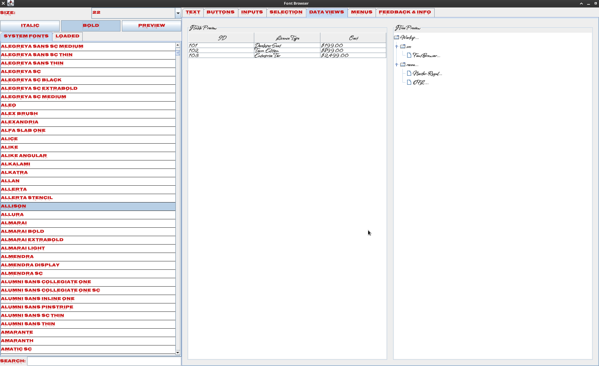
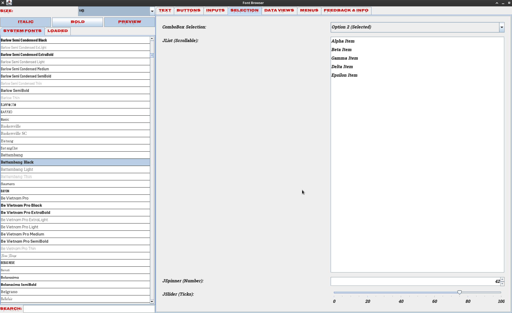

# Font Browser

A simple Java Swing desktop application designed for browsing, filtering, and previewing both system-installed fonts and dynamically loaded external font files (TTF/OTF).

---

## 📸 Screenshots

---

## 🛠️ Build and Run Instructions

This was NetBeans project so use `ant jar` to build it, doesn't require NetBeans.
Or just build it from command line, it's a single Java file with one external font file.

---

## 📄 License

This project is licensed under the MIT License. See the [LICENSE](LICENSE) file for more details.
